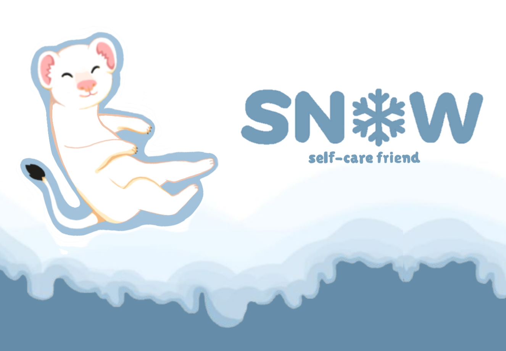

# ❄️ ANÁLISE E DESENVOLVIMENTO DE UM PROTÓTIPO DE SOFTWARE PARA APOIO EMOCIONAL: Snow - Self Care Friend

    
    
    
    

## 🎯 Visão Geral do Projeto

O **Snow** é um protótipo de aplicação web concebido como uma ferramenta de **apoio emocional e autoconhecimento**. Este projeto foi desenvolvido como requisito final do **Projeto Integrador (PI)** para a conclusão do Curso Técnico em Informática do **CEDUP Abílio Paulo - Criciúma SC**.

O projeto visa mitigar os efeitos da crescente crise de saúde mental na sociedade.

---

### ⚠️ Contexto e Impacto Social

A crise de saúde mental no ambiente de trabalho é um fato alarmante. **Em 2024, mais de 440 mil brasileiros foram afastados do trabalho por transtornos mentais, um aumento de quase 67% em relação ao ano anterior.** Essa estatística exige soluções tecnológicas com propósito e humanização, e foi com esse foco que desenvolvemos o protótipo:

> O Snow é a nossa resposta a essa crise, oferecendo uma jornada interativa de autoconhecimento para prevenir o esgotamento emocional.

---

### ✨ Diferencial e Funcionalidades

O principal diferencial do SNow é a **interação com um amigo virtual (um furão das neves)**. Este recurso guia o usuário nas práticas e transforma o gerenciamento do bem-estar em uma jornada interativa, guiada e menos solitária.

* **Acompanhamento de Emoções:** Registro e gestão diária dos sentimentos.
* **Guia Interativo:** O amigo virtual auxilia e guia o usuário em práticas de relaxamento.
* **Espaço Acolhedor:** Ambiente seguro para autoconhecimento e busca por equilíbrio emocional.

---

## 💻 Habilidades e Competências Desenvolvidas

O desenvolvimento do SNow exigiu a aplicação e o aprimoramento de um conjunto de competências técnicas e interpessoais.

### 🤯 Soft Skills

Nosso principal desafio — a gestão de tempo e a pesquisa de recursos — reforçou nossas habilidades em:

* **Organização e Planejamento:** Essenciais para dividir e cumprir as etapas do Projeto Integrador.
* **Resiliência:** Capacidade de superar obstáculos e aprender com os erros no desenvolvimento de software.

### ⚙️ Hard Skills em Destaque

O desenvolvimento do SNow envolveu a aplicação prática de diversas tecnologias e ferramentas, demonstrando proficiência em:

| Categoria | Tecnologia | Uso no Projeto |
| :--- | :--- | :--- |
| **Front-end** | HTML, CSS, JavaScript | Estrutura, estilização e lógica de interação. |
| **Back-end** | PHP | Lógica de negócios e comunicação com o DB. |
| **Banco de Dados** | MySql | Persistência dos dados (registros emocionais e usuários). |
| **Ambiente de Servidor** | Xampp | Execução do ambiente local (Apache e MySql). |
| **Design/UX** | Figma, IbisPaintx, Canva | Prototipagem e criação de ativos visuais. |
| **Gestão** | Trello, VS Code | Gerenciamento de tarefas e ambiente de codificação. |

---
### 👩🏽‍💻 SQL do Banco de Dados

[**Acessar SQL do banco de dados (SQL)**](SQL/tccsnow.sql)

---

### 📖 Manual do Usuário

Acesse a documentação completa do projeto SNow, incluindo tutoriais de uso e funcionalidades, através do manual criado no Canva:

[**Acessar Manual do Usuário (PDF)**](docs/Manual_usuario_TCC.pdf)

---

## 🤝 Autoria e Créditos

Este projeto foi desenvolvido por:

* **Érica Bonfanti Corrêa** - https://github.com/EricaBonfanti
* **Laura De Bona Sartor** - https://github.com/Laura-Sartor

**Orientadora Acadêmica:** Jessica Ronconi Dondossola
